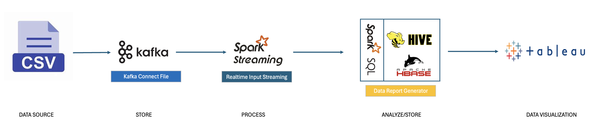

# Big Data Technologies Final Project

## Project Overview
This project aims to demonstrate a real-time data pipeline for extracting, transforming, loading, analyzing, and visualizing questions asked on Reddit.

The pipeline will utilize various technologies including Kafka for real-time data ingestion, Spark Streaming for data processing, Hive/HBase for data storage, Spark SQL for data querying and Tableau for data visualization.



## Prerequisites

- Docker
- JDK 1.8
- Maven
- Kafka

## Project Setup

- Build docker image, refer to guideline inside [cloudera-quickstart-docker](./cloudera-quickstart-docker/README.md#build-docker-image) directory.
- Start docker containers:
```
docker-compose up -d
```
- Build `Realtime Input Streaming` component, refer to guideline inside [realtime-input-streaming](./realtime-input-streaming/README.md#build-the-project).
- Build `Data Reporter Generator` component, refer to guideline inside [data-report-generator](./data-report-generator/README.md).

## Run Applications

Firstly, you need to import data, to import data, refer to guideline inside [data-importer](./data-importer/README.md).

- Run the `Realtime Input Streaming` application, refer to [realtime-input-streaming](./realtime-input-streaming/README.md#run-the-application).
- Run the `Data Report Generator` application, refer to [data-report-generator](./data-report-generator/README.md#run-the-application).
- View report, refer to [Visualization](./Visualization/README.md).


## Team Information
Professor: `Mrudula Mukadam`

Students:

- Van Nhinh Nguyen
- Rahel Teklu
- Giao Hieu Tran
- Phuong Khanh Nguyen