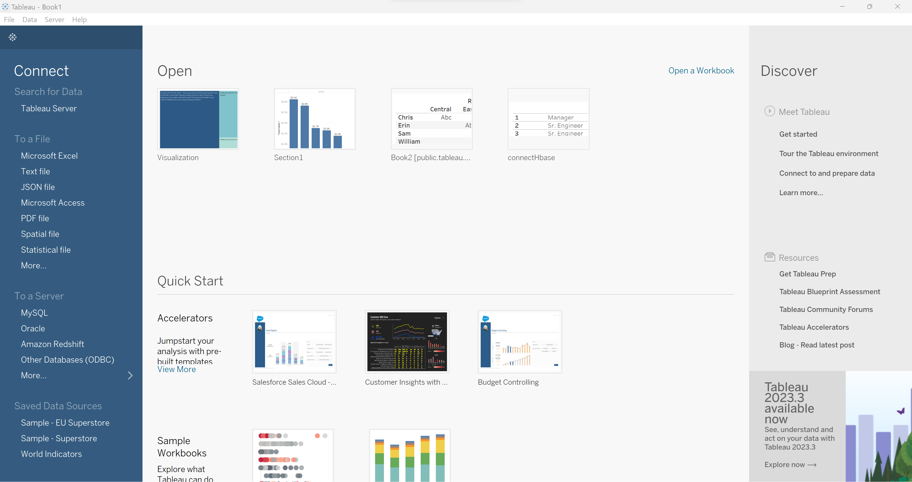
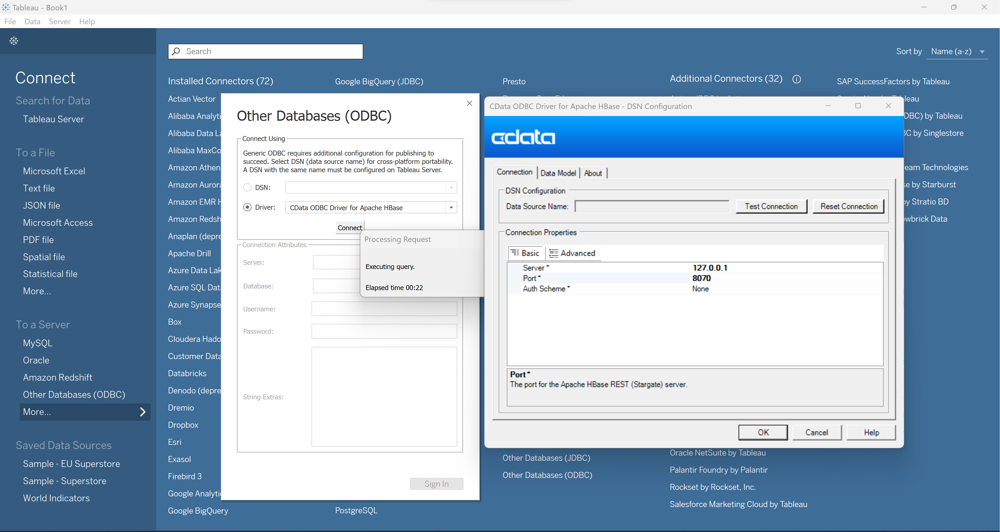
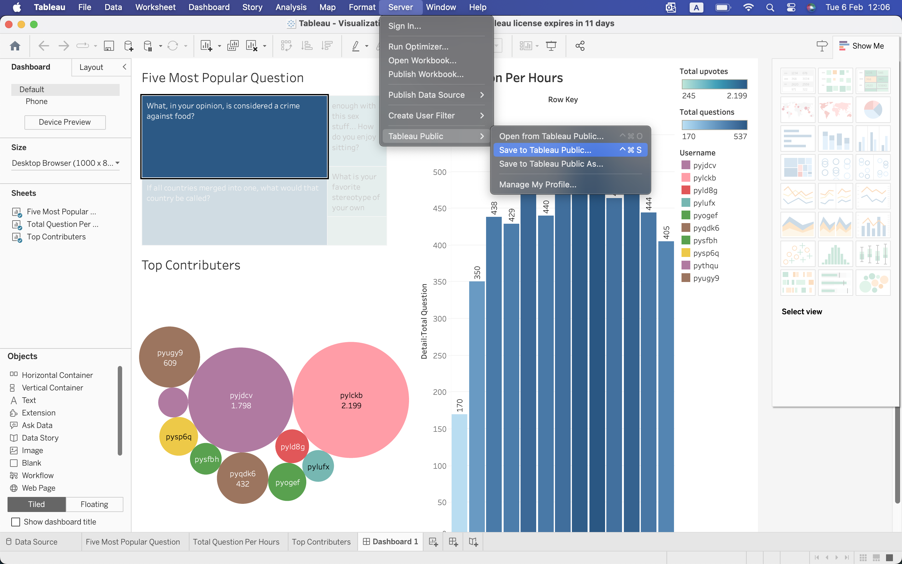

# Tableau Visualization
## Install Tableau and HBase ODBC Driver

| Software | Link |
| ------ | ------ |
| Tableau Desktop | https://www.tableau.com/products/desktop/download |
| HBase ODBC Driver | https://www.cdata.com/drivers/hbase/download/odbc/ |

## Set up to connect Tableau to HBase
Open Tableau Desktop, File -> Open -> Visualization.twb.

In part `To a Server` click “more -> Other Databases (ODBC). In tab `Connect Using`, choose “Driver -> CData ODBC Driver for Apache HBase” . Click “Connect” then input Server (Check this information from VMWare or Docker – REST HBase, in my case is 127.0.0.1) and Port(Check this information from VMWare or Docker – REST HBase, in my case is 8070) in tab `Connection Attributes`.

## Public the project to cloud
To public in cloud, From Dashboard Screen, Choose Server -> Save to Tableau -> Then login to tableau cloud  

Link [Result](https://public.tableau.com/app/profile/khanh.nguyen5783/viz/Visualization_17071090555810/Dashboard1?publish=yes) on Tableau Cloud

